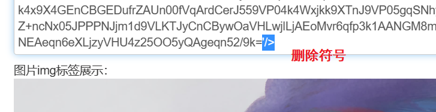

[TOC]

# 规划

* 需求分析
* 设计（概要设计，详细设计）
* 技术选型
* 搭建项目，初始化项目/引入需要的技术框架
* 写demo，用于测试
* 写代码，实现业务逻辑
* 测试，进行单元测试
* 代码提交到远程仓库，代码评审
* 部署（放到服务器或者容器），灰度发布，或者忽略....

# 需求分析

功能：用户注册-->登录成功之后，可以将本地图片通过用户拖拽到指定的页面框内，利用百度接口返回图片识别的关键词等结果，将相关信息存储到数据库当中，下次用户再次输入关键字的时候，将符合条件的图片返回给用户。

优化点： 

1. 有文字识别和物体识别，后期让用户自己选择，跳转不同的接口
2. 将拖到页面内的图片可以进行删除操作（也许是拖错了呢doge）

# 数据库设计

1. 1. 确定实体：

2. * 图片 

3. * 用户

   2. 确定属性：

   *  图片{ 图片id，关键字（可以将查出来的keyword放在一起，进行模糊查询即可），图片保存的本地url（这里可以随机生成uuid作为图片名称），所属的用户id，创建时间 }
   * 用户{ 用户id，用户头像，账号，密码，性别，电话，邮箱，是否有效（0代表被封号，1代表正常），是否删除用户（这里用的逻辑删除，并不是从数据库真正删除，只是将值变为0/1来分别表示，这一点在mybatis-plus当中是支持的），创建时间 }

   3. 确定实体之间的关系（一对一？一对多？多对多？），私以为一个用户可能有多个图片，一个用户本地自己的图片只能对应一个用户，就是自己，所以用户和图片之间的关系是一对多。
   4. 画出E-R图：

   

   

# 技术选型

前端： 三件套 + React + 组件库 Ant Design + 开发框架Umi + Ant Design Pro(现成的管理系统)

后端： java + ssm + mybatis + mybatisPlus + springboot + mysql

部署： 服务器/容器（平台），当作不存在好了。

# 百度接口测试

* 利用百度提供的接口，从本地上传图片，官方文档说的很清楚，需要对图片进行base64编码，，以下是我将本地的图片利用（[在线加密解密 (oschina.net)](https://tool.oschina.net/encrypt?type=4) 工具编码的过程：

​     

​     然后用postman测试了一下，结果发现编码内容太多了，直接复制粘贴卡住了，我去百度智能云那里在线调试的时候，却是很快粘贴了，那....这个问题先不予考虑，假定本地也可以成功。以下是我用url的方式请求的结果:


# 初始化项目

## 前端初始化

上ant design pro官网看看就好了，最终本地打开页面效果：


我们需要的应该是个图片框，这里安装一下umi ui,选择需要的页面组件：

```
tyarn add @umijs/preset-ui -D
//或者
npm install --save-dev @umijs/preset-ui
```

安装之后页面上将多出一碗米饭

这里我选择的是支持拖动也支持点击的上传模块，文件支持单个和多个：

之后的效果：


## 后端初始化

>  我还纳闷了，为啥我的代码全红了，一看pom.xml也跟着红了，有点喜庆，坏了，想起来了，今天下午闲来无事我把mvn仓库删了，总结教训就是文件名没有做到见名知意，觉得碍眼就删了，好吧，那重新下载一下吧，配置好之后又坏了，可能用的版本过高，和我的21版idea还不兼容，好吧，那就降低版本吧，重下，唉，这次可以，不过就是第一次就是需要加载好长时间......

1. 去start.spring.io直接拉取springboot的框架
2. 导入mybatis-plus依赖（数据库需要用到，具体用法参考官网）
3. 复制粘贴代码
4. 测试

既然把依赖导入了，那就把接口的代码复制粘贴进去吧

## 数据库/表的创建和初始化

> 可以用navicat，也可以idea直接连接，下面直接选择在idea当中使用数据库。

一。设计字段名以及类型

* 图片表：

* * 图片id  photo_id，

* * 关键字（可以将查出来的keyword放在一起，进行模糊查询即可）key_word，

* * 图片保存的本地url（这里可以随机生成uuid作为图片名称）photo_url，

* * 所属的用户id  belong_id，

* * 创建时间 create_time

* 用户表：

* * 用户id，user_id
  * 用户头像，user_avatar
  * 账号，user_account
  * 密码，user_password
  * 性别，user_sex
  * 电话，user_phone
  * 邮箱，user_email
  * 是否有效（0代表被封号，1代表正常），is_valid
  * 是否删除用户（这里用的逻辑删除，并不是从数据库真正删除，只是将值变为0/1来分别表示，这一点在mybatis-plus当中是支持的），is_delete
  * 创建时间create_time

  

  用户表：

```sql
create table user_photo.table_user
(
    user_id       bigint                             not null comment '用户id'
        primary key,
    user_avatar   varchar(1024)                      null comment '用户头像',
    user_account  varchar(255)                       null comment '用户账户',
    user_password varchar(512)                       null comment '用户密码',
    user_sex      tinyint                            null comment '用户性别',
    user_phone    varchar(128)                       null comment '电话
',
    user_email    varchar(512)                       null comment '邮箱',
    is_valid      int      default 1                 not null comment '是否有效,0表示封号，1表示正常',
    is_delete     tinyint  default 1                 not null comment '逻辑删除，0表示删除了，1表示没有删除',
    create_time   datetime default CURRENT_TIMESTAMP not null comment '创建时间'
)
    comment '用户表';

```

​    图片表：

```sql
create table user_photo.table_photo
(
    photo_id    tinyint auto_increment comment '图片id'
        primary key,
    key_word    varchar(10240)                     null comment '限制大小为10k,10240个字节，1k = 1024字节（B）',
    photo_url   varchar(512)                       null comment '本地存储图片的url',
    belong_id   bigint                             null comment '所属的用户id，外键',
    create_time datetime default CURRENT_TIMESTAMP not null comment '图片创建时间',
    constraint table_photo_table_user_user_id_fk
        foreign key (belong_id) references user_photo.table_user (user_id)
)
    comment '图片表';

```

这里需要注意的是当设置外键的时候有两种方式，一种是直接写语句，一种是图形化界面。刚开始也不太确定，稍微试了一下，生成的语句还ok，那应该是对的吧哈哈哈


二。测试数据库的连通性

* 这里使用的是mybatis-plus，去官网https://baomidou.com/参考具体用法即可
* 使用idea插件生成对应的实体类，service以及相应的mapper接口，**数据库**的字段命名方式为使用下划线连接，对应的实体类应该是**驼** **峰**命名方式 ，这里插件自动帮助将数据库字段的下划线转换为实体类当中的驼峰命名。
* 

在表中胡乱的写一些测试数据，最终测试成功


>  ps: 如果前后端不分离，其实应该不难，但是现在前后端分离，对于我来说还是一个挑战。呜呜突然想搞前后端不分离的了，我想可以试一试,那当然前面初始化前后端的工作可没有白做，后面前后端分离的时候，我觉得可以再尝试一下。

# 实现业务逻辑（第一种方式： 前后端不分离）

**前后端不分离**  的思路： 

前端传来图片，后端调用百度接口返回json，将一些有用的信息存到数据库里面，页面上再来一个输入框，搜索关键字，模糊查询数据库，返回对应图片，好了就这样吧，怎么简单怎么来，先来一个小demo看看效果。

后端用的仍然是springboot,但是之前初始化的后端用到了用户之类的，这里为了后面不添麻烦，我再重新建一个项目。

1. 去start.spring.io拉取框架;
2. 去maven仓库找mybatisPlus的依赖，加入pom.xml ;
3. 简单设计一个数据库，单表虽小，五脏俱全(养成好习惯，sql语句专门在项目的根目录下新建一个文件夹sql，存放建表语句)；

```sql
use photo_inseparable;
create table table_photo
(
    photo_id    tinyint auto_increment comment '图片id' primary key,
    key_word    varchar(10240)    null comment '限制大小为10k,10240个字节，1k = 1024字节（B）',
    photo_url   varchar(512)      null comment '本地存储图片的url',
    create_time datetime default CURRENT_TIMESTAMP not null comment '图片创建时间'
)
    comment '图片表';
```

4. 利用mybatisX-generator直接生成对应的service/mapper/impl/xml/pojo
5. 启动成功
6. controller 传下去图片路径 service层调用百度接口

>  java接口参考文档 ： [快速入门 - 图像识别 | 百度智能云文档 (baidu.com)](https://cloud.baidu.com/doc/IMAGERECOGNITION/s/1k3bcxgn4) 

7. 经过一系列的操作，最终写好了持久层，控制层，业务层，看似应该差不多了，但是就是idea被我折腾坏了，我觉得idea为啥有点卡，然后就打算该配置文件的内存那里并且清了一下缓存，结果就是双击打不开了，于是又折腾了一个小时，未果，很简单，重装一个新的。

8. 于是调用百度接口的时候一直说我没权限什么的，刚开始以为是图片路径的问题，不让访问什么的，但是我确认了一下应该不是，那难道是token的原因，但是这个文档里面里没有这一步骤啊，那我再翻翻？结果翻到另一个文档，有token！，于是就好了，是的，它就这么好了。

9. 利用 **GsonFormat** 插件将json转换为对象;

   > 如何将前端传来的JSON数据格式转换成POJO对象 (https://blog.csdn.net/weixin_44757863/article/details/115320699) 

   


# 实现业务逻辑（第二种方式： 前后端分离）

 **前后端分离**  的思路：

​     用户注册登录成功之后，页面上有一个放入图片的地方，目前的想法是前端拖入图片，后端拿到这些图片的路径调用百度接口，返回json之后，将一些字段存入数据库，在页面的某个位置加入一个搜索框，前端接收搜索的文字返回给后端，后端查询数据库，找到对应的本地图片地址，将图片返回给前端。

​    所以前端页面上应该有这样几个部分： 1. 放入图片的框 2. 搜索框 3. 弹出图片的框   。